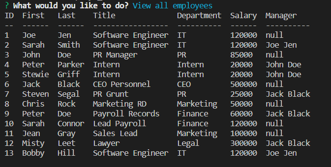

# Employee-Records

## Description

This program was started from scratch. It uses mysql to build a database. I used inquirer to take in the user input and display choices as a list. The database stores three tables, department, company roles, and employees. The department tracks each department name and gives it a unique id. The company roles tracks a unique id, title, salary and the department they are in. Employees tracks id, first name, last name, their role, and manager. 

This is a link to a video. Its a quick demo of the program.
[Youtube](https://youtu.be/ckB2Q5TDac4)

This is a screenshot of what to expect from running the program when you view all employees.




The code snippet below is inside an async function so it waits for the following await line to complete. After it queries the database its saved. I took that save and used a map function to create an key value pair for the inquirer prompt. This is needed as the database may have duplicate first names. Thhe name is what the prompt displays to the user but the javascript operates using the id. 

```javascript
    let promptEmployeesdb = await db.promise().query('SELECT id, name_first FROM employees');
   
    let promptEmployees = promptEmployeesdb[0].map(({ id, name_first }) => ({
        name: `${name_first}`,
        value: id
    }))
```

This code snippet is just like the above but with a twist. As a side note I used backticks, denoting a template literal, so I could structure the query as I needed. I queryed the db just like the first but I wanted to display the first and last names together, so I used the CONCAT method. Template literal was used so I could add a space in the quotes and not have the names displayed side by side. 

```javascript
    let promptEmployeesdb = await db.promise().query(`SELECT id, CONCAT(name_first, " ", name_Last) AS Name FROM employees`);
```

## Installation

Install npm via "npm install". This should install the dependacies needed to run the program. A folder called node_modules will generate which means you are on the right track. Open your terminal in the root folder and start the program with "node start".

[Github Repo](https://github.com/johnfrom209/Employee-Records)

Video Demo
[Youtube](https://youtu.be/ckB2Q5TDac4)

## Usage

Once you install the correct components you can type in your terminal "node index.js" to begin the program. A list of options will be displayed for you to select. Use the arrow keys to navigate the list and press enter to select an operation. Do this as many times as you want and watch the data. At the end you can exit.

## Credits

Uses Node js, inquirer, console table, mysql2.

## Contact Me

[Linkedin](https://www.linkedin.com/in/johnfrom209/)

[View my Github Repo](https://github.com/johnfrom209)

## License

Refer to the license in the Github repo.